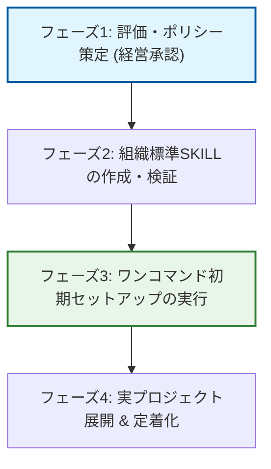

# Antigravity導入・初期セットアップ戦略ガイドブック (経営層向け)

本資料は、意思決定者および経営層に対し、AIエージェント開発プラットフォーム「Antigravity」を組織へ導入・初期セットアップする際の戦略的価値、セキュリティガバナンス、および投資対効果（ROI）を提示するものです。

---

## 1. はじめに：AIエージェント共存型開発モデルの価値

従来のAI支援ツール（単純なコード補完やチャット）と異なり、**Antigravityは「自律的にタスクを遂行するエージェント」**です。エンジニアが指示を与えると、エージェント自身が「計画（Planning）」「実装（Coding）」「検証（Verification）」のサイクルを自動で回し、問題を自己解決します。

この「エージェント共存型開発モデル」により、組織は開発速度の圧倒的な向上と、付加価値の低い定型業務（環境構築、テスト作成、リファクタリング）からのエンジニアの解放を実現できます。

---

## 2. セキュリティ＆ガバナンス戦略

自律的なエージェントの導入にあたり、経営層が最も懸念するリスクに対し、Antigravityは**技術的ガードレール**で応えます。

### ① サンドボックスと権限の局所化
エージェントが実行するコマンドやアクセスできるファイルは、設定されたワークスペース（サンドボックス）内に厳格に閉じられます。機密性の高いシステムへの不正アクセスや、意図しない破壊的コマンドの実行を防止します。

### ② 外部データ送信のコントロール
エージェントが取得したソースコードや機密データが、許可されていない外部のLLMやサーバーへ送信されるのを防止します。組織のセキュリティポリシー（Vertex AI等による社内専用プライベート接続など）を初期設定時に強制適用します。

### ③ インタラクティブな意思決定ゲート
大規模な変更やアーキテクチャの修正など、ビジネス上の意思決定が伴う作業については、エージェントが自律的に実行する前に**必ず人間の確認と承認を求める（Planning Mode）**仕様にし、人間の管理下での自律性を維持します。

---

## 3. セキュリティ・コンプライアンスの技術的強制

ガバナンスの維持において、「エンジニア各自のセキュリティ意識」に依存することは組織的なリスクです。
Antigravityでは、本戦略に基づき構築した**「組織標準セットアップSKILL（`org-setup`）」**を実行することで、プロジェクト開始時に以下の設定を**一括・強制適用**します。

- **`AGENTS.md`（共通ルール）の自動配置**: エージェントが開発時に必ず読み込み、遵守すべきルール（セキュリティ制限、確認ゲートの定義、不要なディレクトリの探索除外）をプロジェクトルートへ自動生成します。これにより、ルール設定の漏れを技術的に防ぎます。

---

## 4. オンボーディングコスト削減とROIの数値化

Antigravityの初期セットアップ自動化は、目に見えるコスト削減とデリバリー速度の向上をもたらします。

### オンボーディング期間の短縮効果（シミュレーション）

新規メンバーがプロジェクトに参画し、開発環境を構築して最初のコードをリリースするまでの時間（オンボーディング時間）の比較：

| 項目 | 従来のセットアップ | Antigravity自動セットアップ | 削減率 |
| :--- | :--- | :--- | :--- |
| Git/エイリアス等設定 | 120分 | **5分 (自動設定)** | -95.8% |
| セキュリティルールの学習・設定 | 180分 | **1分 (`AGENTS.md` 自動適用)** | -99.4% |
| 環境差異によるトラブル解決 | 240分 | **0分 (SKILLによる同一環境再現)** | -100% |
| **合計オンボーディング時間** | **540分 (9時間)** | **6分 (0.1時間)** | **-98.8%** |

### 投資対効果 (ROI)
新規エンジニア10名が参画する場合、**約90時間の開発工数を即座に削減**できます。また、環境構築中のトラブル発生リスクがほぼゼロになるため、プロジェクトの立ち上がり速度（Time-to-Market）が飛躍的に高まります。

---

## 5. 導入・セットアップロードマップ

以下のフェーズに沿って、安全かつ効果的に組織へAntigravityを展開します。

